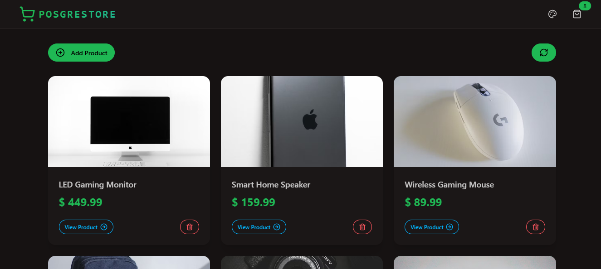

<div align="center">
  <br />
    <a href="#" target="_blank">
      
    </a>
  <br />

  <br />
  <div>
    
    
    
    
    
    
    
    
    
    
  </div>

  <h1 align="center">POSGRESTORE | PERN E-Commerce Platform</h1>

   <div align="center">
     A full-stack product store web application built using the PERN stack (PostgreSQL, Express.js, React, Node.js) with Tailwind CSS for a sleek and responsive UI. Features include user authentication, product management, cart functionality, and order processing. 🚀
    </div>
</div>

## 📋 <a name="table">Table of Contents</a>

1. 🤖 [Introduction](#introduction)
2. ⚙️ [Tech Stack](#tech-stack)
3. 🔋 [Features](#features)
4. 🤸 [Quick Start](#quick-start)
5. ✨ [Contributing](#contributing)

## <a name="introduction">🤖 Introduction</a>

POSGRESTORE is a powerful and scalable e-commerce platform built using the PERN stack (PostgreSQL, Express.js, React.js, Node.js). Designed for a seamless online shopping experience, it features a modern and responsive user interface powered by Tailwind CSS and DaisyUI. With a focus on performance and usability, OSGRESTORE enables users to browse products, manage their shopping carts, and securely complete purchases. The backend, built with Express.js and Nodemon, ensures fast and efficient API responses, while PostgreSQL provides a reliable database solution. Whether you're a business owner looking to sell products online or a developer exploring full-stack development, OSGRESTORE offers a robust and user-friendly foundation for e-commerce success. 🚀

## <a name="tech-stack">⚙️ Tech Stack</a>

- React JS
- JavaScript
- HTML5
- Tailwind CSS
- Node JS
- Express JS
- Nodemon
- POSTGRESQL
- DaisyUI

## <a name="features">🔋 Features</a>

👉 Add, edit, and delete products with details like price, images, and product details.

👉 Responsive & Mobile-Friendly – Built with Tailwind CSS and DaisyUI for a modern UI.

👉 Enhanced user experience with 13 different theme options.

👉 Smooth page interactions using Tailwind's built-in features.

👉 Fast and scalable backend using Express.js & PostgreSQL.

👉 Live updates on product availability and order status.

👉 Seamless UI interactions with React.js hooks.

👉 Product details update immediately without page reload.

👉 Click on a product to see detailed descriptions, images, and pricing.

## <a name="quick-start">🤸 Quick Start</a>

Follow these steps to set up the project locally on your machine.

**Prerequisites**

Make sure you have the following installed on your machine:

- [Git](https://git-scm.com/)
- [Node.js](https://nodejs.org/en)
- [npm](https://www.npmjs.com/) (Node Package Manager)

**Cloning the Repository**

```bash
git clone https://github.com/MenathNDGD/Product-Store-PERN.git
cd Product-Store-PERN
```

**Installation**

**Create a .env file in the root folder**

```bash
PORT=3000

PGUSER=''
PGPASSWORD=''
PGHOST=''
PGDATABASE=''

ARCJET_KEY=
ARCJET_ENV=development

NODE_ENV=production
```

**Get Started**

```bash
npm run build
npm start
```

Open [http://localhost:3000](http://localhost:3000) in your browser to view the project.

## <a name="contributing">✨ Contributing</a>

### 1. Fork the repo.

### 2. Create a new branch:

```bash
git checkout -b feature-name
```

### 3. Make your changes.

### 4. Commit your changes:

```bash
git commit -m 'Add some feature'
```

### 5. Push to the branch:

```bash
git push origin feature-name
```

### 6. Open a Pull Request.

**Feel free to tailor these contents according to your specific preferences or any additional details you want to include!**

- **Contributions:** Contributions are welcome! Feel free to fork the repository, make changes, and submit a pull request.

- **Feedback:** If you have any feedback or suggestions, I would love to hear from you. Reach out via the contact form on the portfolio or open an issue on GitHub.
